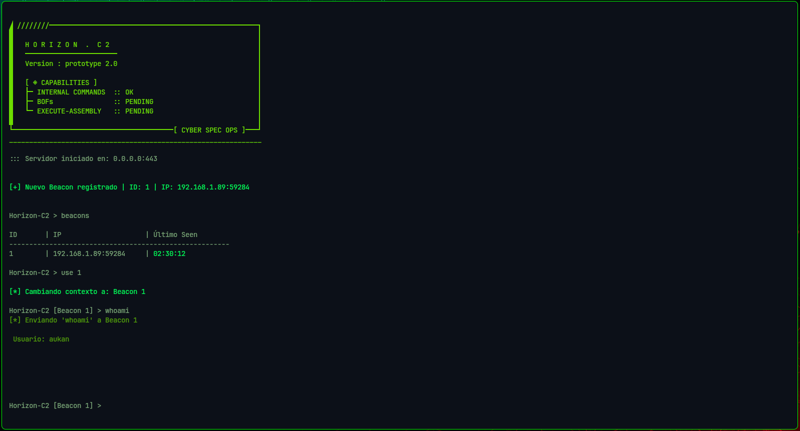
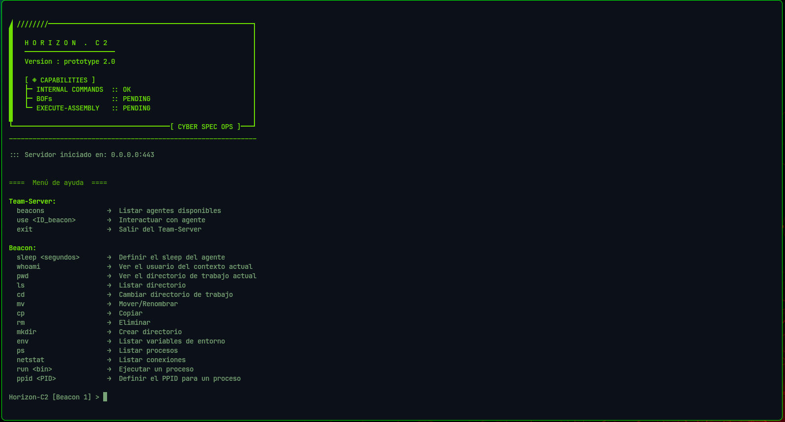
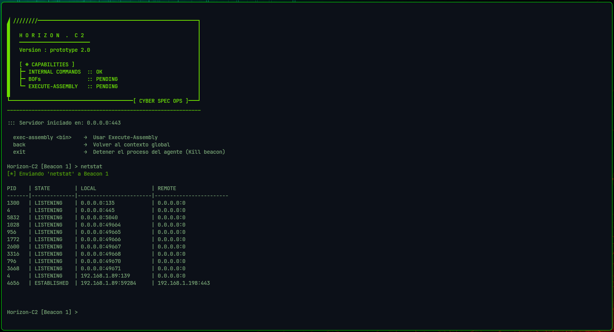
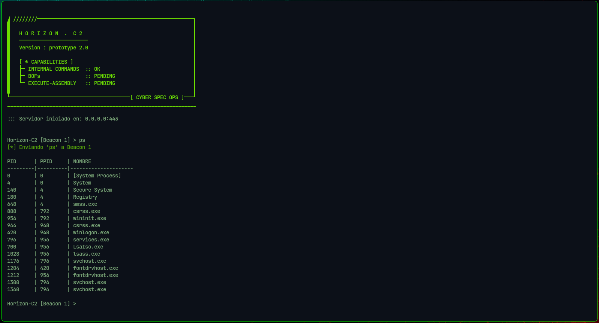
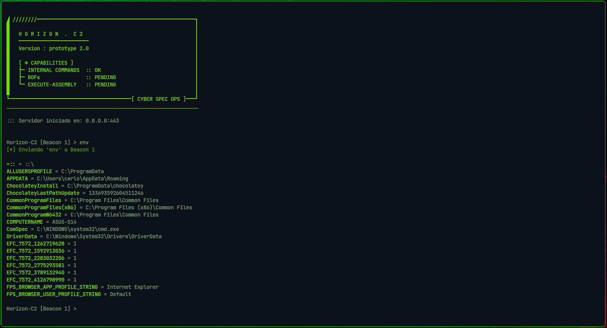
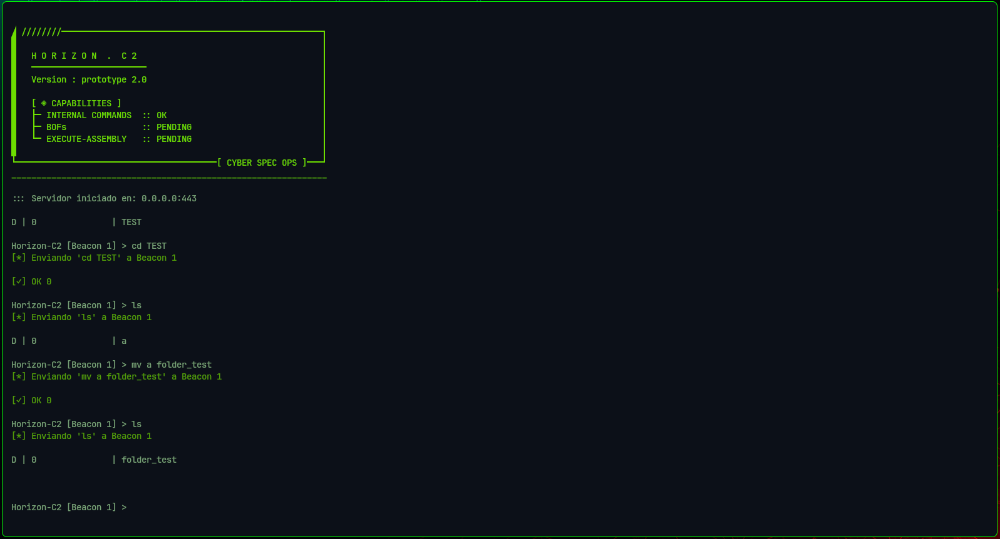

<div align="center">

# ◢ H O R I Z O N . C 2 ◣

[](https://www.rust-lang.org/)
[](https://go.dev/)
[](https://www.microsoft.com/windows)


**Command & Control Framework**

</div>

---

# Resumen

**Horizon-C2** es un framework Command & Control (C2) desarrollado con fines de investigación y aprendizaje para profundizar en arquitecturas empleadas durante operaciones de Red Team.

El objetivo del proyecto es comprender el funcionamiento interno de un framework C2 moderno implementando cada uno de sus componentes, desde el Team Server hasta el Beacon, incluyendo el diseño del protocolo de comunicación, la gestión de sesiones, la interacción con Windows mediante WinAPI y la construcción de una interfaz para el operador.

El código fuente **no se publica**. Este repositorio documenta la arquitectura, las decisiones de diseño y la evolución técnica del proyecto.

---

# Objetivos del proyecto

- Comprender la arquitectura interna de un framework C2.
- Diseñar un protocolo de comunicación propio.
- Desarrollar un Team Server modular.
- Construir un Beacon ligero para Windows.
- Profundizar en el uso de WinAPI desde Rust.
- Aplicar criterios de OPSEC durante el desarrollo.

---

# Arquitectura

```
                   Operador
                       ▼
                  Interfaz UI
                       │
                       ▼
        ┌────────────────────────────────┐
        │        Team Server (Go)        │
        ├────────────────────────────────┤
        │ Gestión de sesiones            │
        │ Dispatcher de comandos         │
        │ Protocolo Horizon              │
        │ Parser de respuestas           │
        └────────────────────────────────┘
                       │
                 HTTPS + TLS
                       │
                       ▼
        ┌────────────────────────────────┐
        │        Beacon (Rust)           │
        ├────────────────────────────────┤
        │                                │
        │  Beacon Context                │
        │  Dispatcher                    │
        │  Output Queue                  │
        │   ├── Filesystem               │
        │   ├── Processes                │
        │   ├── Networking               │
        │   └── Configuration            │
        │                                │
        └────────────────────────────────┘
```


---

# Filosofía de diseño

Horizon-C2 fue desarrollado siguiendo una idea sencilla:

> **Mantener el Beacon pequeño y concentrar la mayor parte de la lógica en el Team Server.**

El agente únicamente mantiene el canal de comunicación, ejecuta tareas y devuelve resultados utilizando un protocolo binario propio.

El Team Server es responsable de la coordinación de sesiones, el despacho de comandos y la representación de la información para el operador.

Esta separación permite mantener el Beacon simple, modular y fácil de extender.

---

# Decisiones de diseño

## Arquitectura modular

El proyecto evolucionó desde un prototipo inicial con un Team Server monolítico hacia una arquitectura modular donde cada componente posee una responsabilidad claramente definida.

Actualmente el proyecto separa la lógica de:

- Red
- Gestión de Beacons
- Procesamiento de comandos
- Interfaz del operador
- Estado global

Esta organización facilitó la incorporación de nuevas capacidades sin incrementar el acoplamiento entre módulos.

---

## Protocolo binario

Horizon-C2 utiliza un protocolo binario propio para el intercambio de tareas y resultados.

Los comandos son representados mediante identificadores y los resultados son serializados utilizando estructuras simples adaptadas a cada tipo de información.

El objetivo fue mantener un protocolo pequeño, sencillo de interpretar y fácilmente extensible.

---

## Beacon ligero

Uno de los principales objetivos del proyecto fue reducir la huella del agente.

Durante el desarrollo se revisaron dependencias, arquitectura y proceso de compilación hasta reducir progresivamente el tamaño del Beacon desde los primeros prototipos (~3.9 MiB) hasta aproximadamente **500 KiB** en la versión actual.

---

## Comunicación

La comunicación entre el Beacon y el Team Server utiliza HTTPS sobre TLS.

La conexión implementa validación mediante una CA embebida en el agente durante el proceso de compilación, evitando depender del almacén de certificados del sistema.

---

## WinAPI

Las capacidades del Beacon fueron implementadas utilizando directamente WinAPI siempre que fue posible, evitando depender de intérpretes como `cmd.exe` o `powershell.exe` para tareas básicas del sistema.

---

# Capacidades actuales

### Gestión

- Múltiples sesiones
- Gestión interactiva de Beacons
- Selección de sesión activa
- Cola de tareas por Beacon

### Sistema

- Enumeración de procesos
- Terminación de procesos
- Variables de entorno
- Información del usuario

### Sistema de archivos

- Navegación
- Copia
- Movimiento
- Eliminación
- Descarga
- Carga de archivos

### Networking

- Enumeración de conexiones TCP

### Configuración

- Sleep dinámico
- PPID configurable

---

# Estado del proyecto

Horizon-C2 continúa en desarrollo.

Actualmente se encuentran en progreso las siguientes capacidades:

- Perfil Maleable-C2
- BOF Loader
- Execute Assembly
- Mejoras del protocolo
- Nuevos módulos internos
- Hardening del Beacon

---

# Capturas









---

# Disponibilidad del código

El código fuente no se publica en este repositorio.

Debido a la naturaleza del proyecto y al riesgo asociado con la distribución de este tipo de herramientas, este repositorio se limita a documentar su arquitectura, evolución y principales decisiones de diseño.

---

# Descargo de responsabilidad

Este proyecto fue desarrollado exclusivamente con fines educativos, investigación en seguridad ofensiva y demostración de capacidades técnicas.

El autor no se responsabiliza por el uso indebido de la información presentada en este repositorio.

---

<div align="center">

**Aukan** | CRTO Certified

</div>
